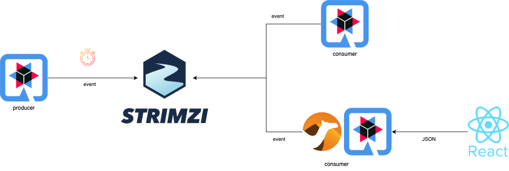

## Demo Quarkus & Streams for Apache Kafka

The producer app generates random metrics of temperature and humidity and publishes it to Kafka with a Quarkus scheduler.

One of the consumers uses Quarkus libraries to connect to Kafka, consumes the events and shows each of them on a frontend.

The other consumer uses Camel libraries to consume events and transform the temperature from Celsius to Fahrenheit degrees. A React frontend consumes an API exposed by the consumer and it shows each of the events. 

  